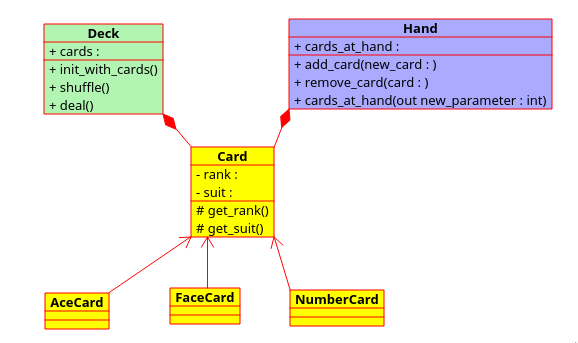

# Cards

Cards are probably the most commonly used game items for board games. Incidentally, the basic organisation of cards in
 many card games that use the Frencch style is similar, and forms a good example to illustrate many object oriented
  programming principles.
  
This repo attempts to model the organisation of cards using the following basic and widely used conventions in card 
games:
  > In a game of cards, each player plays using a hand of cards. Cards are usually delt from a deck. The deck must 
  initially contains all the 52 cards, and shuffled before play. For French style cards, cards are identified using 
  their rank and suit. For the ranks, there's the Ace, then 2 to 10, Jack, Queen and King. The suits are Clubs, 
  Diamonds, Spades and Hearts.
  
  
Using this general description, I have modelled a class structure that employs various principles of object oriented
programming. See image below: 
  
  